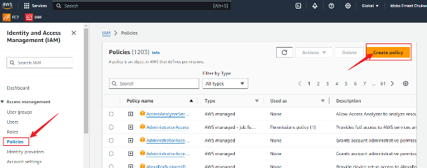
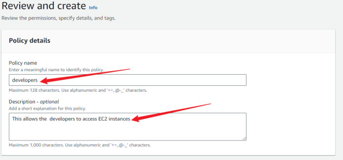

# Mini_Project-Hands-On-AWS

### Project Introduction: 
This project showcases my:

- Solid understanding of AWS Identity and Access Management (IAM), encompassing users, groups, roles, and policies.
- Application of IAM concepts to secure a fintech startup's cloud infrastructure.
- Practical skills in utilizing the AWS Management Console for effective IAM management.

Designed to guide new AWS users, this project focuses on creating and managing users by leveraging AWS's IAM functionalities to ensure that customer information is securely managed and that access to resources is tightly controlled. AWS IAM plays a pivotal role in achieving these security objectives by allowing the company to define who is authenticated (signed in) and authorized (has permissions) to use resources.

### Objectives:

1. Create and Manage AWS Users and Groups: Control access to AWS services and resources securely.
Utilize IAM Roles and Policies:

2. Set more granular permissions for AWS services and external users or services that need to access Zappy e-Bank's AWS resources.

3. Implement Strong Access Controls: Enhance security through measures like multi-factor authentication (MFA).

In this project, new users will work with a hypothetical fintech startup named **Zappy e-Bank**. This fictitious company represents a typical startup in the financial technology sector, aiming to leverage the cloud's power to innovate, scale, and deliver financial services. The scenario provides a realistic backdrop, helping users understand the practical application of AWS IAM in managing cloud resources securely and efficiently.

### Tools Utilized:
1. **GitHub:** Used for hosting and documenting the project in a GitHub repository, facilitating version control and collaboration.
2. **GitBash:** Employed for cloning the repository to the local machine and creating folders for snapshots.
3. **Visual Studio Code:** Utilized for writing and editing Markdown files, aiding in the project's documentation.
4. **Markdown:** Used for creating structured and visually appealing documentation.
5. **Snipaste:** A tool used to capture screenshots of processes, which were then saved for documentation purposes.

### Project Setup
1. Log in to the AWS Management Console: Use your administrator account to login.

2. Navigate to the IAM Dashboard: Here, you'll manage users, groups, roles, and policies.

### Creating IAM Users
Let's set up IAM users for a backend developer, **John**, and a data analyst, **Mary**, by first determining their specific access requirements.

- John, as a backend developer, needs access to servers (EC2) to run his code. Therefore, his IAM user should have policies granting EC2 access.

- Mary, as a data analyst, requires access to data storage **(AWS S3 service)**. Hence, her IAM user should have policies enabling S3 access.

### Creating Policy for the Development team
1. In the IAM Console, click on policies and then Create Policy

2. In the select a service section, search for ec2

3. For simplicity sake, select the **All EC2 action** checkbox

4. Also, make sure to select **ALL** in the Resources section

5. Click Next

6. Provide the name **developers** and description for the policy.

7. Click on **Create policy**

8. Notice that after creating the policy, if you search for **developer** in the search box, you will notice that a number of policies are returned. This highlights the presence of both AWS managed and customer managed policies. **AWS managed polices** are predefined by AWS and provides permissions for many common use cases, allowing for quick and broad access management across AWS services without the need for custom policy creation like we just did. In contrast, customer managed policies are created and fully controlled by you, allowing for more tailored, specific access controls that can be finely tuned to your organization's requirements.

### Creating Policy for the Data Analyst team
1. In the IAM Console, click on policies and then Create Policy

2. In the select a service section, search for S3.

3. For simplicity sake, select the **All S3 action** checkbox

4. Also, make sure to select **ALL** in the Resources section

5. Click Next

6. Provide the name **Analyst-TEAM** and description for the policy.

7. Click on **Create policy**

8. Notice that after creating the policy, if you search for **Analyst** in the search box, you will notice that a number of policies are returned. This highlights the presence of customer managed policy you just created. 

## CREATING GROUPS

### Create Group for the Development team

1. In the IAM console navigation, select **User group** and in the top right click Create group

2. Provide an a name for the group

3. Attach the developer policy we created earlier to the group. This will allow any user in the **Development-Team** group to have access to EC2 instances alone.

4. You have successfully created a group and attached a permission policy for any user added to the group to have access to the EC2 instance only. Users of this group will be backend developers only.

### Create Group for the Data Analyst team

1. In the IAM console navigation, select **User group** and in the top right click Create group

2. Provide an a name for the group

3. Attach the data analyst policy we created earlier to the group. This will allow any user in the **Analyst-Team** group to have access to AWS S3 alone.

4. You have successfully created a group and attached a permission policy for any user added to the group to have access to the S3 only. Users of this group will be Data Analysts only.

## CREATING IAM USERS

### Creating IAM User for John - **Development-Team**

1. Navigate to the IAM dashboard, select "Users" and then click "Create user"

2. Provide the name of the user. In this case "John", ensure that the user can access the AWS Management Console.

3. Click Next

4. **Permissions:** Add **John** to the development team group.

5. Review and Create User

6. Download the login credentials for **John**

### Creating IAM User for Mary - **Analyst-Team**

1. Navigate to the IAM dashboard, select "Users" and then click "Create user"

2. Provide the name of the user. In this case "John", ensure that the user an access the AWS Management Console.

3. Click Next

4. **Permissions:** Add **Mary** to the development team group.

Review and Create User

5. Download the login credentials for **Mary**

## Testing and Validation

### Testing John's Access

1. Login as John (STEP 1)

Login as John (STEP 2)

2. John (Successfuly Logedin)

3. John (EC2 Dashboard)

4. John (Successfully Launched Instance)

### Testing Mary's Access

1. Login as Mary (STEP 1)

Login as Mary (STEP 2)

2. Mary (Successfuly Logedin)

3. Mary (Successfully Launched Instance)

The above actions validate John and Mary's access to EC2 and S3 respectively, ensuring they cannot access other AWS services beyond what their group policies permit. This validation adheres to the principle of least privilege, enhancing security by limiting access to only what is necessary for each user's role.

## Implementing Multi-Factor Authentication (MFA)

### Setting Up MFA for John

1. Click on **User** and then click on john.

2. Click on enable MFA as shown in the image below

3. Enter a device name for john MFA and select authenticator app.

4. Open **Google authenticator** or **microsoft authenticator** application on your mobile devie to scan the QR Code, then you can fill in the 2 consecutive codes as shown in the image below then click add MFA.

5. By completing step 1-5, MFA will be enabled for john

### Setting Up MFA for Mary

1. Click on **User** and then click on mary.

2. Click on enable MFA as shown in the image below

3. Enter a device name for john MFA and select authenticator app.

4. Open **Google authenticator** or **microsoft authenticator** application on your mobile devie to scan the QR Code, then you can fill in the 2 consecutive codes as shown in the image below then click add MFA.

5. By completing step 1-5, MFA will be enabled for mary

### Project Reflection
**Question 1:** Describe the purpose of Identity and Access Management (IAM) in Amazon Web Services and how it contributes to the security and efficient management of cloud resources.

**Answer:** Identity and Access Management (IAM) in Amazon Web Services (AWS) is essential for controlling who can access specific AWS resources and what actions they can perform. IAM helps maintain security by enabling administrators to create users and groups with tailored permissions, ensuring that only authorized individuals can interact with the cloud environment. This system supports efficient resource management by applying the principle of least privilege, which limits access rights to the minimum necessary, thus reducing potential security risks.

**Question 2:** Discuss the differences between IAM users and IAM groups within the context of AWS. Provide examples of when you would create an IAM user versus when you would organize users into groups.

**Answer:** In AWS, IAM users are individual accounts with specific credentials used to log in and perform actions. Each IAM user can have customized permissions. On the other hand, IAM groups are collections of IAM users that share the same permissions, simplifying management. For instance, if you hire a new developer, you would create an IAM user for them with access tailored to their role. However, if you have multiple developers, you could create a "Developers" group with the necessary permissions and add all developer users to this group, streamlining permission management.

**Question 3:** Explain the steps involved in creating a custom IAM policy for a specific role within an organization. Include details on selecting permissions and attaching the policy to users or groups.

**Answer:** Creating a custom IAM policy involves several key steps:
Identify Requirements: Determine the specific actions and resources the role needs to access.
Draft the Policy: Use the AWS Management Console, CLI, or JSON to write the policy, specifying allowed actions, resources, and conditions.
Review and Validate: Ensure the policy follows best practices and the least privilege principle.
Attach the Policy: Apply the policy to the relevant IAM users or groups by navigating to their configuration in the AWS Management Console and attaching the policy.
For example, a policy for a developer needing EC2 and S3 access would include permissions like ec2:DescribeInstances and s3:ListBucket. This policy would then be attached to a "Developers" group.

**Question 4:** Describe what the principle of least privilege means in the context of IAM and AWS, and why it is important for maintaining security in cloud environments.

**Answer:** The principle of least privilege in IAM and AWS dictates that users should have the minimal level of access necessary to perform their job functions. This approach enhances security by limiting the potential impact of a security breach or accidental misuse. By restricting access, it reduces the attack surface, ensuring users can only perform actions essential to their roles, thus safeguarding sensitive information and maintaining the integrity of the cloud environment.

**Question 5:** Based on the hands-on project setup for John (backend developer) and Mary (data analyst), outline the specific IAM configurations (users, groups, policies) created for each role. Discuss how these configurations align with their job functions and the principle of least privilege.

**Answer:** For **John**, the backend developer, an IAM user was created with a policy granting permissions to manage EC2 instances, reflecting his need to run and maintain code on servers. He was added to a "Developers" group with permissions to access all ec2 instance functions only.

For **Mary**, the data analyst, an IAM user was created with permissions focused on accessing AWS S3, as her role involves data management. She was placed in an "Analysts" group with permissions to access all S3 functions only.

These configurations ensure that John and Mary only have access to the resources necessary for their roles, following the principle of least privilege. John cannot access S3 resources, and Mary cannot manage EC2 instances, thereby limiting their permissions to what is essential for their job functions.

